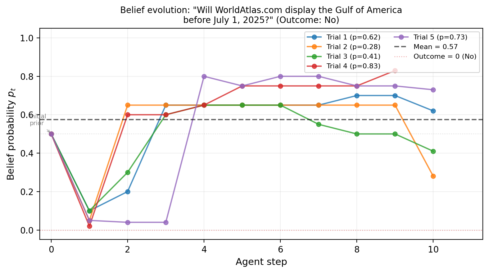
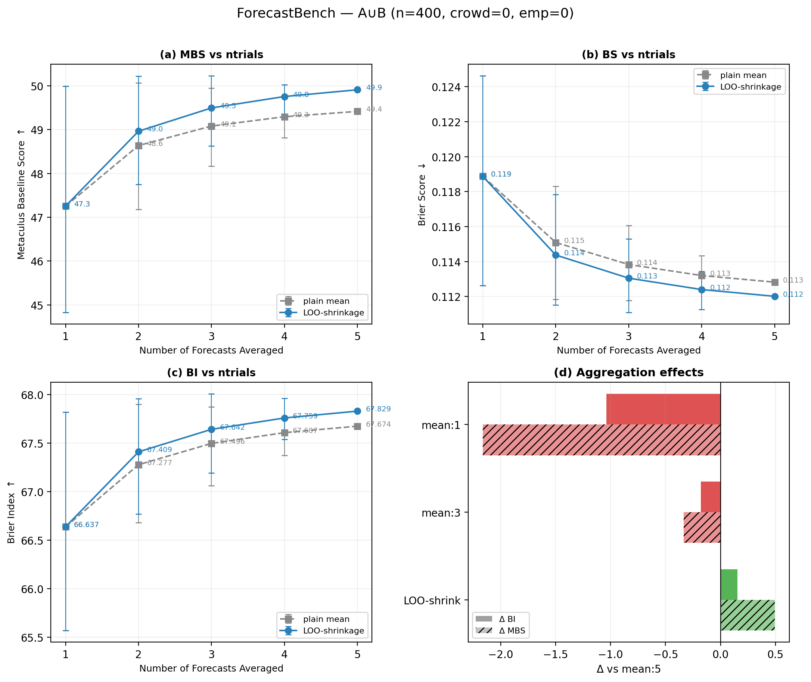
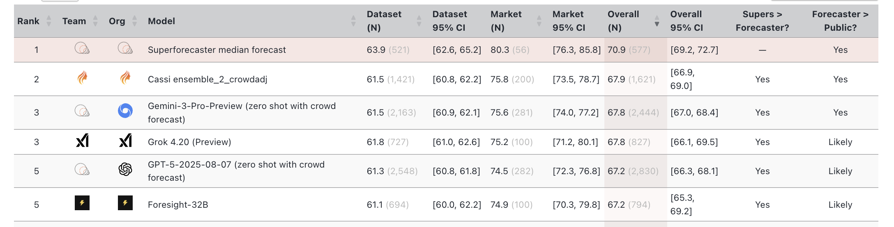

# mneme

> μνήμη — *memory*; the substrate that carries belief forward across agents.

Mneme makes one principle operational: **every artifact in an agent pipeline carries forward both its value AND the evidence that justifies it.** The next agent in the chain conditions on the evidence, not just the value, so when a contract is questioned three steps later the conversation starts from recorded reasoning rather than restarting cold.

## The primitive

A belief in mneme is `(value, evidence_summary)`. The summary is the sufficient statistic — the prose justification a downstream consumer reads to understand *why* this value and not another. Forecasts carry probabilities and reasoning. Tickets carry contracts and rationale. Security findings carry severities and exploit chains. The shape is shared; the discipline is shared.

This generalizes BLF (Bayesian Linguistic Forecaster, [Murphy 2026](https://arxiv.org/abs/2604.18576)) from binary forecasting to every kind of agent artifact.

### Belief evolves under multi-trial



*Each trial is an independent reasoning path. Aggregation in logit space produces the consensus.*

### More trials, better calibration



*The principle is shared across artifact types: independent trials + structured aggregation produces calibrated outputs, single-pass guesses don't.*

### The frontier mneme inherits



*Mneme makes these techniques composable across skills, not just forecasting.*

## Programs

Every invocation produces a **program** — a directory containing the manifest, the typed artifact, a JSONL trace of orchestration calls, the captured Claude sessions, and any child programs spawned via loopback. The directory IS the run. Replay reads it. Audit reads it. Calibration reads it.

```
programs/<program_id>/
  manifest.json          metadata + lifecycle status
  artifact.json          the typed return value
  trace.jsonl            one line per orchestration call
  sessions/              captured claudecode sessions
  skills/<child_id>/     loopback child programs (recursive)
```

## Skills

Skills are the units of capability. Each one is a typed Plexus activation with a documented contract:

| Skill | What it does |
|-------|--------------|
| `forecast` | Binary forecasting with multi-trial aggregation and post-hoc calibration |
| `ticketing` | Writes TDD tickets that pass the two-stranger test |
| `planning` | Breaks goals into dependency DAGs of tickets, with spikes for unknowns |
| `security_review` | Structured SOC2 audit with multi-trial severity calibration |
| `strong_typing` | Proposes newtypes for distinct domain identifiers |

Each skill consumes evidence, produces evidence, and composes with the others through normal Rust function calls inside the substrate (Plexus is the protocol for outside callers; internal composition is direct).

## Architecture

Mneme is a Plexus RPC server. Outside callers (synapse, MCP clients, WS) talk to it as a normal Plexus backend. Inside, modules compose via Rust:

```
External callers
       │
       ▼  Plexus RPC over WS / stdio / MCP-HTTP
┌─────────────────────────────────────────┐
│ Skill activations  ── forecast / ticketing / planning / ...
│       │              (Rust calls, not RPC)
│       ▼
│ Orchestration     ── swarm.trial / aggregate / sequential / race
│       │
│       ▼
│ Claude sessions   ── claudecode (inherited from substrate)
│
│ Substrate runtime ── program lifecycle, per-program tool
│                       registry, session attribution,
│                       calibration store
└─────────────────────────────────────────┘
```

Architecture detail: [`mneme-substrate/docs/architecture/`](https://github.com/hypermemetic/mneme-substrate/tree/master/docs/architecture).

## Repos

| | |
|---|---|
| [mneme](https://github.com/hypermemetic/mneme) | This repo: design, tickets, BLF paper, issues |
| [mneme-substrate](https://github.com/hypermemetic/mneme-substrate) | The Plexus RPC server itself |

## Methodology

Skills are documented at `~/dev/controlflow/hypermemetic/skills/skills/`. The discipline that informs ticket structure (the two-stranger test, the `## Evidence` section, spikes-as-evidence-sources) and the working postures (`presence` for collaboration, `autonomous-work` for solo execution) live there.
